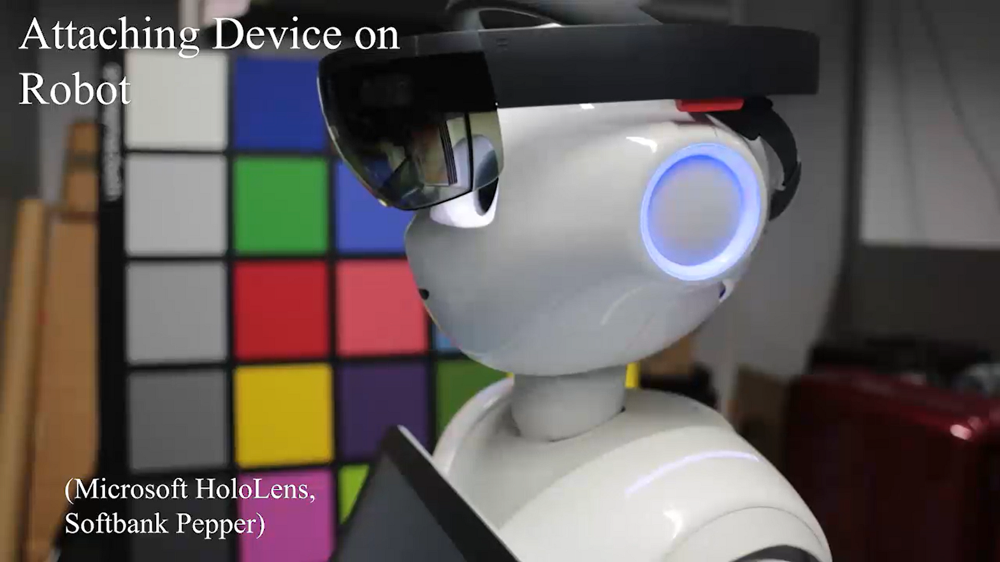
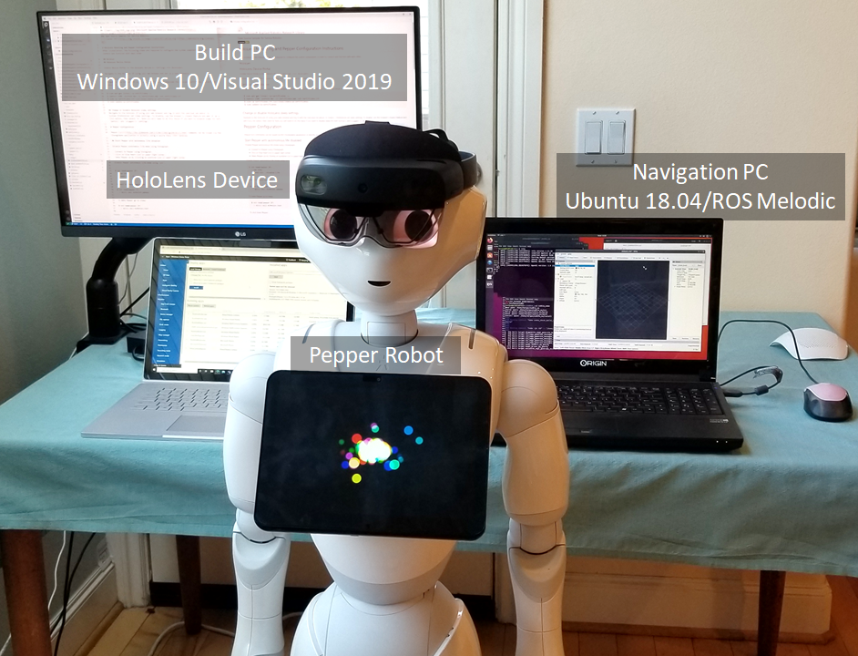
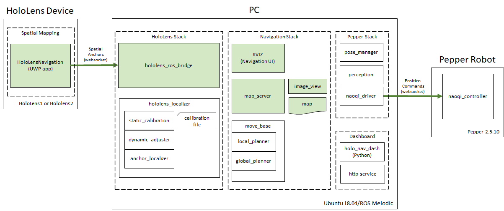
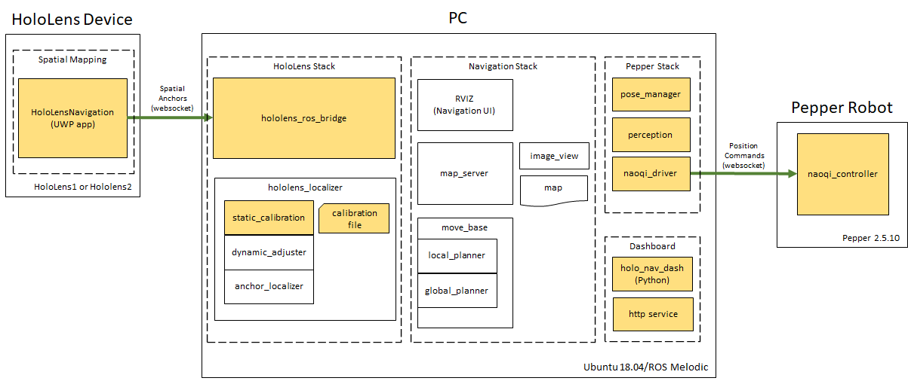
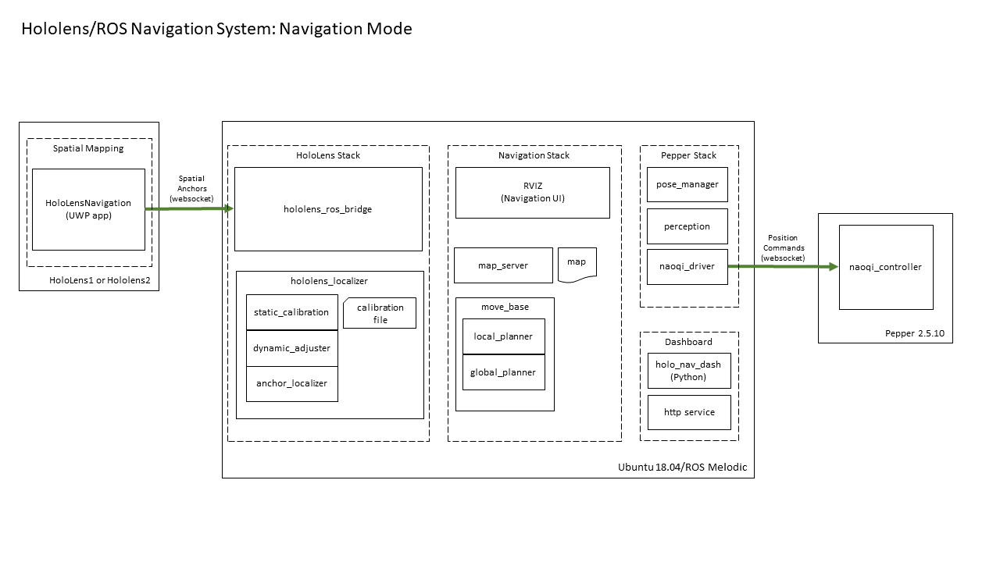
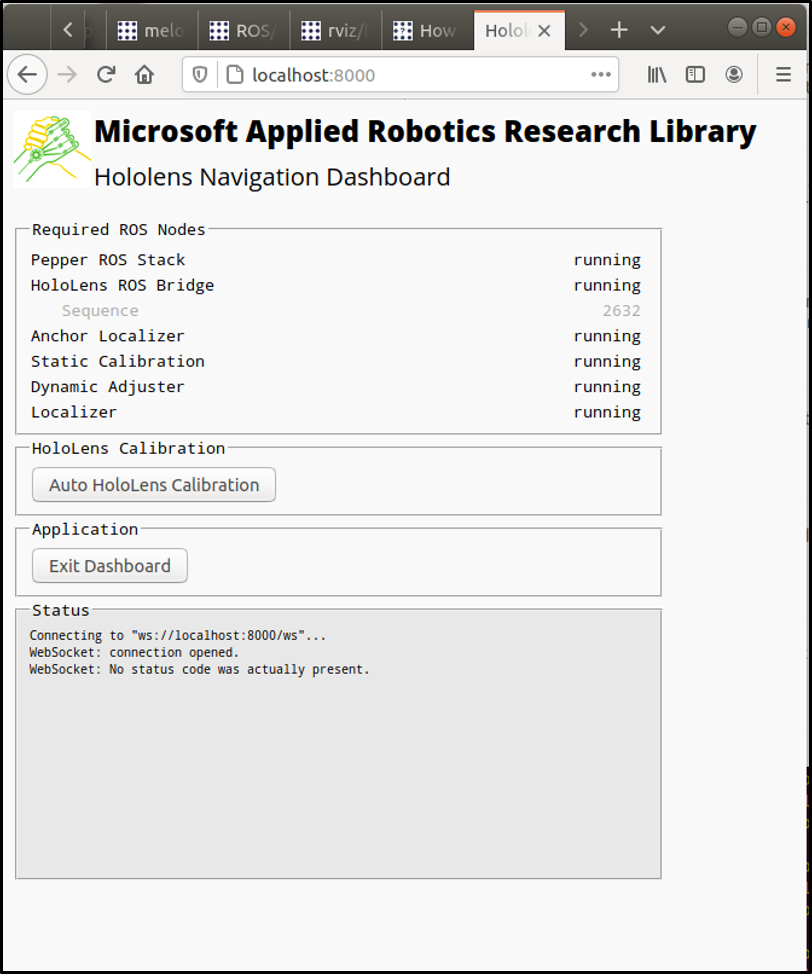
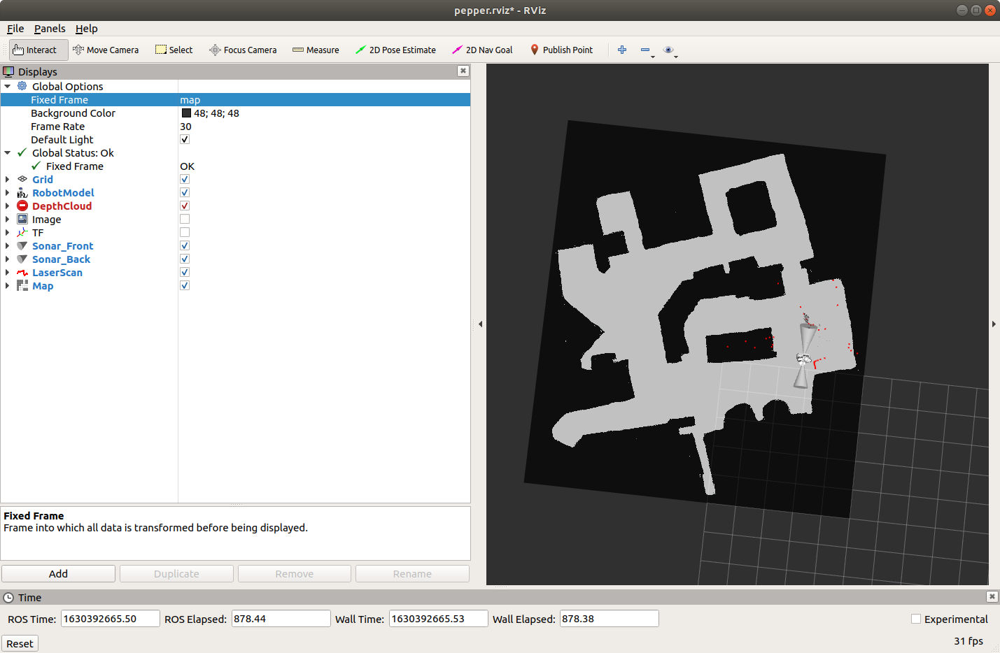
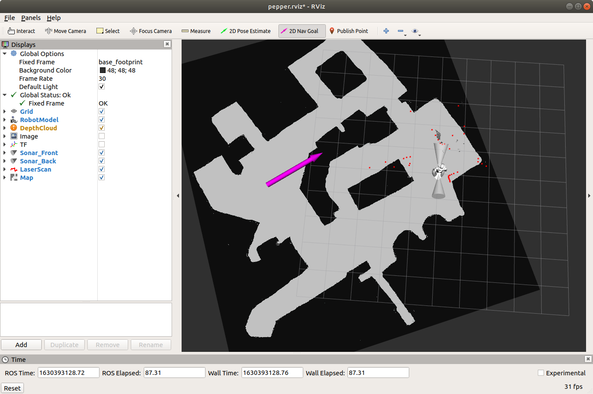

##  [Microsoft Applied Robotics Research Library](https://microsoft.github.io/AppliedRoboticsResearchLibrary/)
### Open Source Samples for Service Robotics
[](https://opensource.org/licenses/MIT) 

# HoloLens Navigation for Robots
Welcome! The example system in this repository shows how a [**HoloLens**](https://www.microsoft.com/en-us/hololens) device can be placed on the head of [**Pepper robot**](https://us.softbankrobotics.com/pepper) and provide it with a self-calibrating indoor navigation solution. The calibration process is described in detail in the paper: [**Dynamic Calibration between a Mobile Robot and SLAM Device for Navigation**](https://www.cvl.iis.u-tokyo.ac.jp/data/uploads/papers/Ishikawa_SLAMDevice_ROMAN2019.pdf) and is demonstrated in the video below ***(click image to download video)*** **:**

[](https://github.com/microsoft/HoloLensNavigationForRobots/raw/main/img/ICRA18_1498_VI_i.mp4 "Project Video")

## Who might be interested in using this repository?
The HoloLens Navigation For Robots project is an example system that exposes key technology challenges in helping robots get where they need to be. Its purpose is to support research and education in the field of ***Indoor Robot Navigation*** with an instruction guide for building a sample navigation software system that runs on off-the-shelf hardware components and lends itself to modifications and experimentation. Its function is to measure environmental parameters with 3D spatial sensors to compute and calibrate the position of a robot's mobile base relative to a HoloLens device attached to its head to enable the use of the generic ROS indoor navigation solution for service robots. The designation **"service-robot"** refers to a requirement that it is designed to safely operate in the midst of humans, as opposed to an **"industrial-robot"** that usually repeats tasks within a cordoned-off safety zone. The HoloLens Navigation for Robots repository was adapted from a project originally created by interns working for Microsoft Research Asia. We've built on their work and put together this repository and instruction set to help students learn with a fun hand's-on project that provides exposure to key technologies used in service-robotics. Researchers in the field of autonomous navigation can use the repository to support experimentation in the use of intelligent solutions for route-planning and hazard-avoidance.

No matter where your interest lies, we hope you find the HoloLens Navigation for Robots repository a fun and easy way to work and learn in the field of robotics.

# How It Works
The system is comprised of three primary hardware components that run the software code modules and navigation operations: a Pepper robot, a HoloLens device, networked together with and bridged to the ROS navigation solution running on a Navigation PC. Additionally, a Build PC running  Windows 10 is required to compile and deploy this project's sample application onto the HoloLens device. 



The system operates in one of three modes: 
- Map Capture
- Calibration
- Navigation  

In the map capture mode, the system takes the 3D environment captured by the HoloLens device and converts it into a 2D map image compatible with the built-in ROS navigation solution. In the calibration mode, the system animates the robot and calculates the position of the HoloLens device mounted on the Pepper robot's head relative to the position of the robot's base, which contains the motorized wheels. In the navigation mode, the system uses the dynamic position of the HoloLens device in the navigation space to indicate the position of the robot's mobile base, which is driven by the ROS navigation solution based on plans computed in response to goal points indicated by the user on a 2D map.

## Hardware Devices:
- **HoloLens (ver. 1 or 2)** - battery-powered mobile computer hosting camera and depth sensors used for map capture and localization

- **Navigation PC (Ubuntu 18.04)** - x64 PC hosting ROS (Melodic) navigation solution, calibration, and operational scripts

- **Pepper robot** - battery-powered semi-humanoid robot capable of indoor locomotion and independent movement of head and body parts

- **Build PC (Windows 10)** - x64 PC hosting Visual Studio 2019 solution for building and deploying the HoloLensNavigation UWP app on the HoloLens device

## Sample Software Modules:

- **HoloLensSpatialMapping** - Universal Windows Platform (UWP) application solution for HoloLens. It contains two projects:

  - **HololensSpatialMapping** - Uses device sensors to capture and maintain 3D map of local environment

  - **HoloLensBridge**  - Communication link with ROS system running on the PC
  
- **hololens_localizer** - Custom ROS (Melodic) package that computes the local position of the robot base using sensor measurements as the robot moves through calibrated poses and navigates through the environment. During offline calibration, it computes the relative positions of the HoloLens device on the robot's head and the robot's base
  
  -  **static_calibration** - node calculates the transform offset between the HoloLens device and the Pepper robot's base and stores it in the **calibration file**
    
  - **dynamic_adjuster** - node that monitors the neck joint positions of the robot and adjusts the transform offset between the HoloLens device and the robot base as needed.
   
  - **anchor_localizer** - node that provides the calculated dynamic position of the robot mobile base relative to the 2D navigation map

- **hololens_ros_bridge** - Custom ROS (Melodic) package providing IP communication between the HoloLens device and the ROS system

- **holo_nav_dash** - Custom ROS (Melodic) package providing a local http server and a browser-based operational interface for starting up and monitoring calibration and navigation operations

- **navigation_launcher** - Custom ROS (Melodic) package that contains launch scripts for starting up components for the HoloLens stack, the HoloLens Navigation stack, and the ROS Navigation stack

## Other Software Modules
- [**map_server**](https://wiki.ros.org/map_server) - built-in ROS node that stores and serves data requests from the map asset

- [**image_view**](https://wiki.ros.org/image_view) - built-in ROS node for viewing image topics and provides the image_saver tool for capturing a graphic image file of the map

- [**rviz**](https://wiki.ros.org/rviz) - built-in ROS node for navigation operations

- [**move_base**](https://wiki.ros.org/move_base) - built-in ROS node providing an implementation of an action that, given a pose (position) goal on the map using rviz, will attempt to reach it by sending movement commands to the robot's mobile base

- [**global_planner**](https://wiki.ros.org/global_planner) - built-in ROS node that give a current position and a goal postion on a 2D map, calculates a route through obstacles indicated on the map
 
- [**base_local_planner**](https://wiki.ros.org/base_local_planner) - built-in ROS node calculates the motor control commands to send to the base in order to follow a route calculated by the global planner

- [**Pepper Naoqi Stack**](https://developer.softbankrobotics.com/pepper-naoqi-25) - Pepper SDK software providing IP communication nodes between the PC and the Pepper robot, as well as a pose_manager node that interprets movement requests into hardware joint motor commands

# Modes of Operation
The system operates in one of three modes: map generation, position calibration, and navigation.

## Map Capture and Generation Mode


The purpose of this mode is to create a 2D floorplan of the navigable indoor space. First, the HoloLensNavigation application is run on the HoloLens device while the user scans the indoor space to be navigated by methodically moving it throughout the location.  The camera and depth sensors in the device are used to capture and store a 3D spatial map of the room and adjacent areas.

After capture, the 3D spatial map must be converted to the 2D floor-plan map form used by the ROS navigation solution. The conversion is accomplished by first launching the hololens_ros_bridge, hololens_localizer, map_server, image_view, and rviz ROS nodes on the PC. The point cloud from the HoloLens spatial map is made available to the ROS system through the hololens_ros_bridge.

After the ROS nodes are running, rviz is instructed to use the image_view node and the "2D Pose Estimate" process to create a cross-section of the HoloLens' spatial map six inches above and parallel to the floor plane and then save it as a 2D point-cloud image in a JPG file. Using any image editing application, the 2D point cloud is then manually cleaned up to produce a ROS-compliant floorplan navigation map image.

## Position Calibration Mode


The purpose of this mode is to create a static calibration file that defines the relative positions of the Hololens device mounted on the Pepper robot's head and the robot's base containing movement wheels and motors. The HoloLensNavigation app connects to the hololens_ros_bridge node running on the Operations PC and provides spatial anchors representing the current position of the HoloLens device within the 3D map space.

On the PC, the Dashboard UI is launched with the holo_nav_dash ROS node and a local http server providing access to data from other ROS nodes as well as Naoqi protocol commands that are sent to the Pepper robot. Buttons are provided in the UI that command the Pepper head to move to specific positions and record sensor readings for use in calculating a static relationship between the position of the robot base and the HoloLens mounted on the robot's head and then store it in a calibration file.

## Navigation Mode

This is the operational mode for navigation. In this mode all the nodes are running. On the Hololens, the HoloLensNavigation app connects to the hololens_ros_bridge node running on the Operations PC and constantly updates spatial anchors for the position of the HoloLens device and dynamic changes in the 3D environment.

Through the hololens_ros_bridge, the hololens_localizer nodes monitor the spatial anchor for the HoloLens device and use the static calibration file to constantly calculate and update the relative position of the Pepper robot's base.

The ROS navigation stack presents a user interface through the built-in RVIZ application. The RVIZ application is configured to dynamically render the simulated robot's position and spatial sensor data on the 2D navigation map. The RVIZ UI is used to manually position the robot on the navigation map to set an initial "2D Pose Estimate" (2D position and polar direction). Checking that the set position agrees with dynamic sensor data within a tolerance threshold, the ROS navigation stack becomes prepared to accept goal positions.  The RVIZ UI is now used used to set a "2D Nav Goal" on the navigation map. When a navigation goal is received, the move_base node links the local_planner and global_planner nodes to steer and drive the robot's wheels toward the goal until the spatial anchor from the hololens_localizer shows that it has arrived at the destination. 

# System Build and Installation
The following links provide guides for preparing the system.  They include hardware mounting and configuration, software platform prerequisites, and build and installation instructions.

- ## [Setup Instructions](Setup/SETUP.md)

- ## [Map Generation Instructions](Setup/MAP_GENERATION.md)

- ## [HoloLens Mounting and Pepper Configuration Instructions](Setup/CONFIGURATION.md)


# Calibration and Navigation Operations
The following step-by-step procedure provides a guide for performing the calibration process and commanding the Pepper robot to navigate its way around the space represented by the map.  ***The procedure assumes that all of the previous sections' setup and configuration instructions have been completed and a 2D floor map has already been generated and installed in the system***.
 
## Launch System
### HoloLens Stack
- (HoloLens) Launch HoloLens Bridge
    - Start the HoloLensNavigation application from the browser-hosted **Device Portal** or alternatively launch it from the device's in-visor Start menu
- (Navigation PC) Launch Pepper's stack
    - The **network interface** name for the local ROS computer can be found using the terminal command "ifconfig" and looking for the name associated with the active IP address. ***Do not include the colon after the network interface***.
    - The **pepper ip** address for the robot will be verbally reported when the button on the front of the torso and behind the bottom edge of the tablet is tapped. 

      ```
      $ roslaunch pepper_bringup pepper_full.launch nao_ip:=<pepper ip> network_interface:=<network interface>
      ```

- (Navigation PC) Launch HoloLens Stack
    - The **hololens ip** value is obtained from the address bar in the browser hosting the **Device Portal** or from the device's in-visor Settings menu
      ```
      $ roslaunch navigation_launcher hololensstack.launch HoloLens_ip:=<hololens ip>
      ```

### Navigation Stack
- (Navigation PC) Launch ROS Navigation System
    ```
    $ roslaunch navigation_launcher navstack.launch
    ```

### Dashboard UI
- (Navigation PC) Launch the Dashboard User Interface
    ```
     $ rosrun holo_nav_dash holo_nav_dash.py
    ```

## Perform Calibration

On the Navigation PC, open your favorite web browser and follow these steps to perform an automatic static calibration and save the data in a text file:

 

- navigate to http://localhost:8000
- Confirm that all the Required ROS Nodes listed in the UI are running
- Click the **"Auto HoloLens Calibration"** button in the UI
- Observe the robot move through the calibration poses and then check the Status window to confirm that a calibration file was successfully saved


## Navigation Operations
Once the system is running and configured, it is ready to perform navigation operations within the physical space represented by the installed map. The following steps start and control navigation:
- (Navigation PC) Launch ROS RVIZ
  ```
  $  rosrun rviz rviz
  ```
- RVIZ will launch showing the 2D map file with a simulated model of the Pepper robot.

   

- Use the application GUI to load the [pepper.rviz](rviz/pepper.rviz) rviz configuration file.

- In the RVIZ GUI, click the **2D Pose Estimate** button and set Pepper's inital position and direction on the map by right-clicking and dragging across the map. The initial position is indicated by the mouse-down click and the direction is calculated from the relative positions of the mouse-down and then mouse-up points on the map.  The position must be precise enough to ensure the map data is in harmony with live data coming from the robot's spatial sensors. If the position is within the precision threshold, the script will calculate a pose estimate and localize the Pepper model on the map.

   

- In the RVIZ GUI,  click the **2D Nav Goal** button and select a destination goal and direction for the robot on the map in the same manner used to set the initial 2D Pose Estimate.

   

- If a valid path can be calculated by the ROS Navigation Stack, the  robot will be begin navigation and movement to the goal position.
- Once arrived or before arriving at the destination, a new **2D Nav Goal** can be specified with the RVIZ GUI and the robot will stop moving to the previous goal position and proceed to the new destination.


