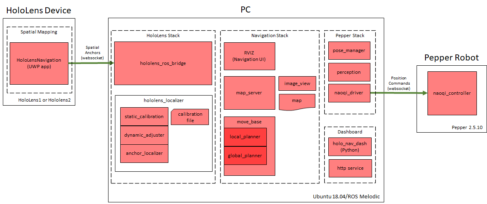

##  [Microsoft Applied Robotics Research Library](https://special-giggle-b26bab5f.pages.github.io/)
### Open Source Samples for Service Robotics
[](https://opensource.org/licenses/MIT) 

# HoloLens ROS Navigation System
The HoloLensNavigation system shows how a [HoloLens](https://www.microsoft.com/en-us/hololens) device can be placed on the head of [Pepper robot](https://us.softbankrobotics.com/pepper) and provide a self-calibrating indoor navigation solution.


# How it Works
## System Diagram


## Sample Code Modules:

### HoloLensSpatialMapping
Universal Windows Platform (UWP) application solution for HoloLens. It contains two projects:
- HololensSpatialMapping: Uses device sensors to capture and maintain 3D map of local environment
- HoloLensBridge:  Communicates with HoloROSBridge.

### HoloLens_Localization
HoloLens_Localization is a ROS (Melodic) package that computes the local position of the robot based on sensor measurements as the robot moves through calibrated poses and navigates through the environment.
ROS package including HoloLens Localization module, offline calibration between HoloLens and Robot's head, and online calibration between HoloLens and Robot's base.

### HoloROSBridge
HoloROSBridge is a ROS (Melodic) package that communicates with the HoloLensSpatialMapping application running on the HoloLens device.
ROS package of HoloLens brigde.
Module for using HoloLens in ROS system.

### holo_nav_dash
holo_nav_dash is a ROS (Melodic) package that provides a local http server and a browser-based operational interface for starting up and monitoring calibration and navigation operations.

### navigation_launcher
navigation_launcher is a ROS (Melodic) package that contains launch scripts for starting up components for the HoloLens stack, the HoloLens Navigation stack, and the ROS Navigation stack.

## Modes of Operation
The system operates in one of three modes: map generation, position calibration, and navigation.

### Map Capture and Generation Mode

### Position Calibration Mode

### Navigation Mode


## Prerequisites, Installation and Build
Follow these links for instructions in preparing the system:
- ### [Setup Instructions](Setup/README.md)

- ### [Map Generation Instructions](Setup/MAP.md)

- ### [HoloLens Mounting and Pepper Configuration Instructions](Setup/MountHololens.md)


## Calibration and Navigation Operations
The following procedure assumes that a 2D floor map has already been [generated and installed](Setup/MAP.md):
 
### Launch System and Perform Calibration
#### HoloLens Stack
- (HoloLens) Boot HoloLens Bridge
    - Launch the HoloLensNavigation application from Device Portal (access the HoloLens ip from browser). Or use alternative methods.
- (ROS) Launch Pepper's stack
    - `$  roslaunch pepper_bringup pepper_full.launch nao_ip:=<pepper ip> network_interface:=<network interface>`
    - The local ROS computer's network interface name can be found using the terminal command "ifconfig" and looking for the name associated with the active IP address. Do not include the colon after the network interface.
    - Ideally start Pepper with life disabled. Use Choregraph or refer to the [tips](/Setup/TIPS.md) document for alternative options.
- (ROS) Launch HoloLens stack
    - `$ roslaunch navigation_launcher hololensstack.launch HoloLens_ip:=<hololens ip>`
    - Note that XTerm needs to be installed for this as the script uses it to interact with the calibration.

#### Navigation Stack
- (ROS) Launch Navigation program
    - ```roslaunch navigation_launcher navstack.launch```

#### Calibration
- in the calibration window:
    - move Pepper's head into inital/default pose. Use either Choregraph or connect to Pepper via SSH and set the pitch directly:
      - ```qicli call ALMotion.setAngles "HeadPitch" 0.0 0.3```
      - ```qicli call ALMotion.setAngles "HeadYaw" 0.0 0.3```
    - press ```space``` to record the initial position.
    - move Pepper's head upward. Use either Choregraph or connect to Pepper via SSH and set the pitch directly:
      - ```qicli call ALMotion.setAngles "HeadPitch" -0.35 0.3```
    - press ```space``` again to record the new position.
    - reset Pepper's head pitch and then rotate to left. Use either Choregraph or connect to Pepper via SSH:
      - ```qicli call ALMotion.setAngles "HeadPitch" 0.0 0.3```
      - ```qicli call ALMotion.setAngles "HeadYaw" 0.7 0.3```
    - press ```space``` to record the new position.
    - rotate Pepper's head to the right. Use either Choregraph or connect to Pepper via SSH:
      - ```qicli call ALMotion.setAngles "HeadYaw" -0.7 0.3```
    - press ```space``` to record the new position.
    - press ```c``` to calibrate.
    - reset Pepper's head pitch and rotation. Use either Choregraph or connect to Pepper via SSH:
      - ```qicli call ALMotion.setAngles "HeadPitch" 0.0 0.3```
      - ```qicli call ALMotion.setAngles "HeadYaw" 0.0 0.3```


### Navigation Operations
- (ROS) Launch rviz
    - `$  rosrun rviz rviz`
    - add Map and Pepper RobotModel topics. Alternatively, load the [pepper.rviz](rviz/pepper.rviz) rviz configuration file.
- In rviz, select `2D Pose Estimate` and set Pepper's inital position and direction on the map. Try to be as precise as 
 possible. The script will calculate a pose estimate and localize the Pepper model.
- In rviz, select `2D Nav Goal` and select a destination goal and orientation on the map.
- Pepper navigation will start.


### Running Process (INDIVIDUAL NODES)
- Pepper ROS full stack
  - ```$ roslaunch pepper_bringup pepper_full.launch nao_ip:=<pepper ip> network_interface:=<network interface>```
  - example: ```roslaunch pepper_bringup pepper_full.launch nao_ip:=10.1.1.202 network_interface:=enp3s0```
- HoloLens ROS Bridge
  - ```$ rosrun hololens_ros_bridge hololens_ros_bridge_node <hololens_ip> 1234```
  - example: ```rosrun hololens_ros_bridge hololens_ros_bridge_node 10.1.1.206 1234```
- ROS map_server
  - ```$ rosrun map_server map_server src/navigation_launcher/params/map.yaml```
- HoloLens Anchor Localizer
  - ```$ rosrun hololens_localizer anchor_localizer```
- Localizer Calibration
  - ```$ rosrun hololens_localizer static_calibration <robot odom frame> <robot head frame> <robot base link> [calibrationFileName]```
  - example: ```rosrun hololens_localizer static_calibration odom Head base_footprint calibrationData.bin```
- Dynamic Adjuster
  - ```$ rosrun hololens_localizer dynamic_adjuster.py <robot foot frame>```
  - example: ```rosrun hololens_localizer dynamic_adjuster.py```
