##  [Microsoft Applied Robotics Research Library](https://microsoft.github.io/AppliedRoboticsResearchLibrary/)
### Open Source Samples for Service Robotics
[](https://opensource.org/licenses/MIT) 

# HoloLens Mounting and Pepper Configuration Instructions
After software installation, the following steps are required to configure the system components in order to connect and function with each other.

## Mount HoloLens on Pepper
The HoloLens device can be conveniently secured to the Pepper robot's head using adhesive velcro strips.

Assembly Steps:
 - First, access the Pepper's joint-release key which is stored under the rubber covering near the Emergency Power Off button behind the robot's neck:
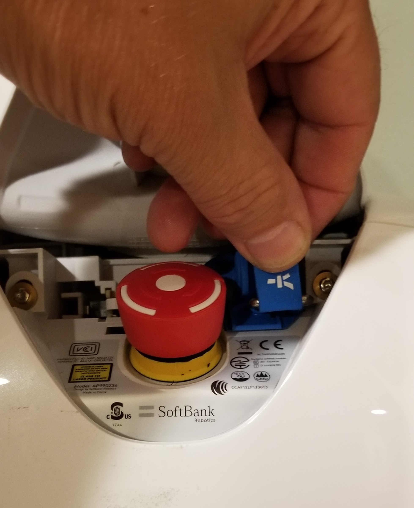 

 - Use the joint-release key to remove the access-cover on the back of the robot's head by inserting it into the two holes below the cover:
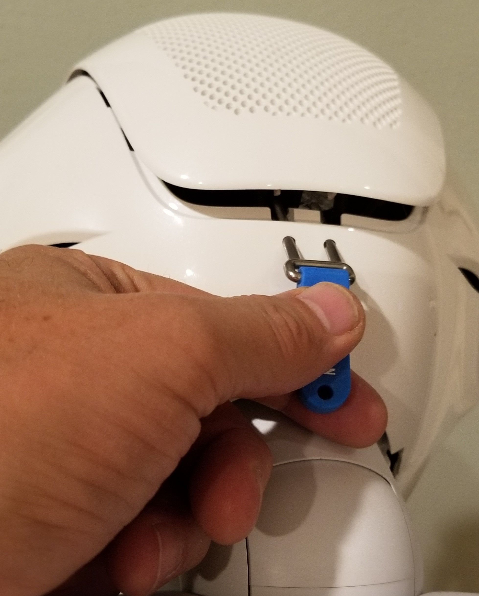 

 - Make a head back strap with adhesive velcro by cutting 10-inch strips of both the hook and loop sides and sticking their adhesive sides together.  Attach the strap by slipping it between the flexible fan housing and the head-cover support beam:
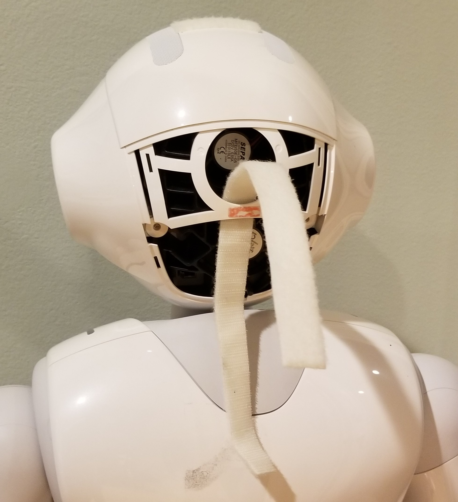 

 - Affix a 2.5 inch and a 3.5 inch adhesive velcro loop pad to the top of the robot's head in the positions shown:
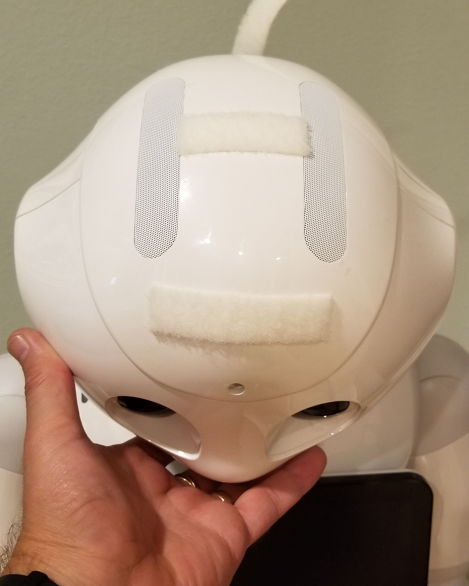 

 - Set the HoloLens device over the robot's head and open the head-band adjust band all the way by rotating the knob all the way to the left:
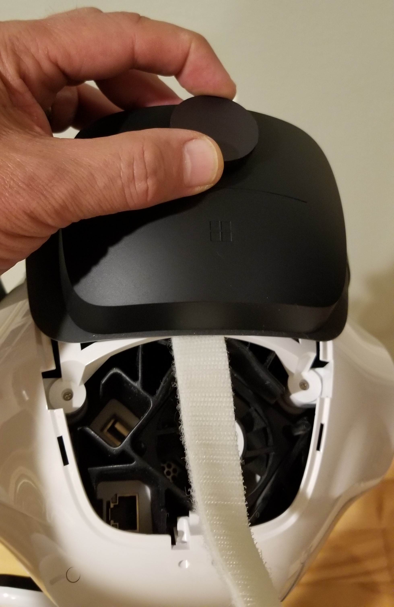 

 - Secure the back of the HoloLens device to the back of the robot's head by tightly creating a closed loop with the two-sided Velcro head strap.
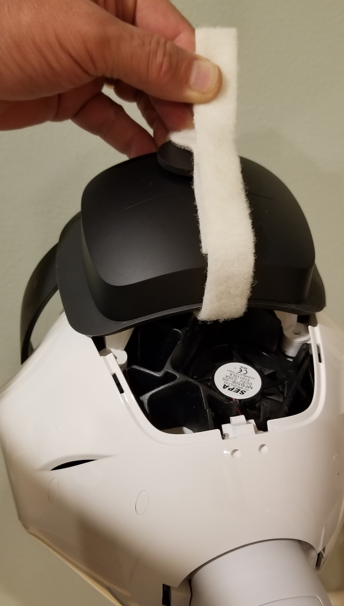 

 - Make a second mount strap by creating a 2.5 inch two-sided Velcro strip and securing it over the loop surface of both the HoloLens headstrap and rear mounting pad.
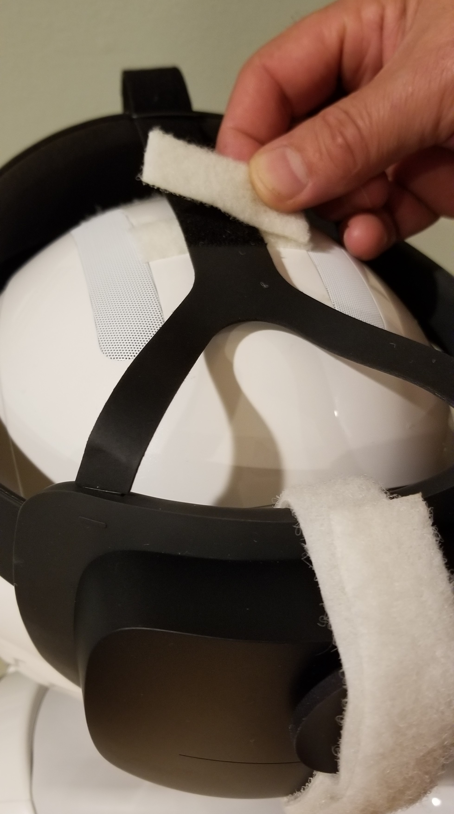 

 - Make a third mount strap by creating a 3.5 inch two-sided Velcro strip and securing it over the loop surface of both the HoloLens headstrap and front mounting pad and bringing over the hook side of the HoloLens headstrap to the loop side of the same strap:
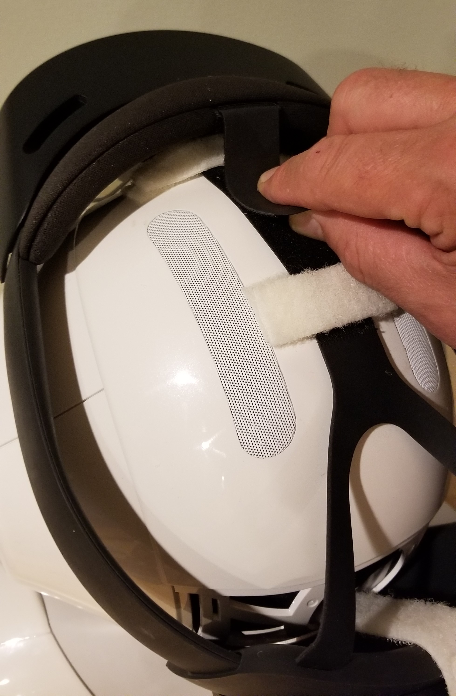 

# Pepper Configuration

Pepper [qicli](http://doc.aldebaran.com/2-5/dev/libqi/guide/qicli.html) commands can be issued via the Choregraphe application or directly using a secure shell (SSH) terminal. The Pepper robot's IP address can be obtained by tapping the button on the front of the robot's torso and underneath the bottom edge of the tablet mounted on its chest. The address will be spoken by the robot. If a new wireless network needs to be configured, in some cases a wired ethernet connection must be made to the back of the robot's head. An embedded web server in the robot provides a management website at the robot's IP address.

Detailed documentation and further resources for the Pepper robot are on this website:

**https://developer.softbankrobotics.com/pepper-naoqi-25/pepper-documentation**

## Install Choregraph (Optional):

If desired, the Pepper robot's native programming and configuration application **Choregraphe** can be installed on either the Navigation or Build PC from these webpages:

**https://developer.softbankrobotics.com/pepper-naoqi-25-downloads-linux**

**https://developer.softbankrobotics.com/pepper-2-5/downloads/pepper-naoqi-25-downloads-windows**

**Tip:**  If Choregraph fails to start on the Navigation PC (linux), try:
```
sudo ln -sf /usr/lib/x86_64-linux-gnu/libz.so /opt/'Softbank Robotics'/'Choregraphe Suite 2.5'/lib/libz.so.1
```

## Start Pepper with autonomous life disabled

If Choregraphe is available, disable the Pepper robot's autonomous life behavior:

- Connect to Pepper using Choregraph.
- Click on blue heart icon in upper right corner.
- Wake Pepper up by clicking on sunshine icon in upper right corner
 
img\HololensNavigation_Choregraphe_AutonLifeOff.png

Otherwise, disable Pepper autonomous life mode using the secure shell **ssh**:

```
$ ssh nao@<pepper IP>
  > nao stop
  > naoqi-bin --disable-life
```
## Pepper Naoqi Shell Commands
For reference, following are some example commands that can be ran on the Pepper robot over a secure shell session. 

A complete listing of the NAOqi API is in the Pepper documentation here:
  
- **https://developer.softbankrobotics.com/pepper-naoqi-25/naoqi-developer-guide/naoqi-apis**

Wake Pepper up:
```
$ ssh nao@<pepper IP>
  > qicli call ALMotion.wakeUp
```

Make Pepper go to sleep:
```
  > qicli call ALMotion.rest
```

Shut down Pepper (*The connection will close and further control will be lost until the robot is powered back up*):
```
  > sudo shutdown -h now
```

Get the joint names for the body or a chain:
```
  > qicli call ALMotion.getBodyNames "Body"
```

View Pepper's current joint state:
```
  > qicli call ALMotion.getSummary
```

Change Pepper's head pitch:
```
  > qicli call ALMotion.setAngles "HeadPitch" 0.0 0.1
```

***Note:*** **setAngles** is a non-blocking call with the following parameters:
- **names** – The name or names of joints, chains, “Body”, “JointActuators”, “Joints” or “Actuators”.
- **angles** – One or more angles in radians
- **fractionMaxSpeed** – The fraction of maximum speed to use

Valid Pepper joint names can be found [**here**](http://doc.aldebaran.com/2-5/family/romeo/joints_romeo.html?highlight=joint) and [**here**](https://developer.softbankrobotics.com/nao6/nao-documentation/nao-developer-guide/kinematics-data/effector-chain-definitions#nao-chains),
or call **getBodyNames** for a complete list.

## Pepper RVIZ Configuration File
The configuration file for the Pepper robot will set up ROS nodes for convenient operations as well as present a simulated model of the robot on the navigation map.

Location: ***/opt/ros/melodic/share/naoqi_driver/share/pepper.rviz***

# Miscellaneous
The folowing instructions are optional and provide alternative methods to perfom setup and configuration actions. They are intended to be helpful in system modification and/or troubleshooting.

## Enumerate network interfaces on Ubuntu:
The following IP commands can be used on the Navigation PC's console UI to expose values needed for configuration:
```
$ ip l show
$ ip a show eno1
```

## Naoqi Command Sequence for Calibration Positions
As an alternative to the Dashboard UI, the console UI in the calibration window can be accessed via an SSH terminal to set the head angles directly. In these examples the first value indicates the joint motor, the second value indicates the angle to move to in radians and last value indicates the speed of movement in seconds.

- move Pepper's head into inital/default pose: 
  ```
  $ ssh nao@<pepper IP>  
  > qicli call ALMotion.setAngles "HeadPitch" 0.0 0.1
  ```
  ```
  > qicli call ALMotion.setAngles "HeadYaw" 0.0 0.1
  ```
  - press ***space bar*** to record the initial position
  - move Pepper's head upward:
  ```
  > qicli call ALMotion.setAngles "HeadPitch" -0.35 0.1
  ```
  - press ***space bar*** again to record the new position
  - reset Pepper's head pitch and then rotate to left:
  ```
  > qicli call ALMotion.setAngles "HeadPitch" 0.0 0.1
  ```
  ```
  > qicli call ALMotion.setAngles "HeadYaw" 0.7 0.1
  ```
  - press ***space bar*** again to record the new position
  - rotate Pepper's head to the right:
  ```
  > qicli call ALMotion.setAngles "HeadYaw" -0.7 0.1
  ```
  - press ***space bar*** again to record the new position
  - press ***"c" key*** to calibrate
  - reset Pepper's head pitch and rotation:
  ```
  > qicli call ALMotion.setAngles "HeadPitch" 0.0 0.1
  ```
  ```
  > qicli call ALMotion.setAngles "HeadYaw" 0.0 0.1
  ```

## Running Individual Processes
The following terminal commands will launch the ROS software modules individually.
- Pepper ROS full stack
  ```
  $ roslaunch pepper_bringup pepper_full.launch nao_ip:=<pepper ip> network_interface:=<network interface>
  ```
  - example: 
  ```
  $ roslaunch pepper_bringup pepper_full.launch nao_ip:=10.1.1.202 network_interface:=enp3s0
  ```

- HoloLens ROS Bridge
  ```
  $ rosrun hololens_ros_bridge hololens_ros_bridge_node <hololens_ip> 1234
  ```
    - example: 
  ```
  $ rosrun hololens_ros_bridge hololens_ros_bridge_node 10.1.1.206 1234
  ```
- ROS map_server
  ```
  $ rosrun map_server map_server src/navigation_launcher/params/map.yaml
  ```
- HoloLens Anchor Localizer
  ```
  $ rosrun hololens_localizer anchor_localizer
  ```
- Localizer Calibration
  ```
  $ rosrun hololens_localizer static_calibration <robot odom frame> <robot head frame> <robot base link> [calibrationFileName]
  ```
    - example: 
  ```
  $ rosrun hololens_localizer static_calibration odom Head base_footprint calibrationData.bin
  ```
- Dynamic Adjuster
  ```
  $ rosrun hololens_localizer dynamic_adjuster.py <robot foot frame>
  ```
    - example: 
  ```
  $ rosrun hololens_localizer dynamic_adjuster.py
  ```

## HoloLens Security Certificate Installation

### Build PC
The connection that supports compiled software deployments between Microsoft Visual Studio running on the Build PC and the HoloLens device is secured with a PIN exchange during pairing as described above.  However, the "certificate error" seen in the browser when accessing the HoloLens Device Portal can be fixed by creating a trust relationship with the device.

Each HoloLens generates a self-signed certificate for its SSL connection. By default, this certificate is not trusted by your PC's web browser and you may get a "certificate error". You can securely connect to your device by downloading this certificate from your HoloLens over USB or a Wi-Fi network you trust and trusting it on your PC.

1. Make sure you are on a secure network (USB or a Wi-Fi network you trust).
2. Download this device's certificate from the "Security" page on the Device Portal.
    - Navigate to: https://<YOUR_HOLOLENS_IP_ADDRESS>/devicepair.htm
    - Open the node for System > Preferences
    - Scroll down to Device Security, select the "Download this device's certificate" button.
3. Install the certificate in the "Trusted Root Certification Authorities" store on your PC.
    - From the Windows menu, type: Manage Computer Certificates and start the applet.
    - Expand the Trusted Root Certification Authority folder.
    - Select the Certificates folder.
    - From the Action menu, select: All Tasks > Import...
    - Complete the Certificate Import Wizard, using the certificate file you downloaded from the Device Portal
4. Restart the browser

***Note:*** This certificate will only be trusted for this device and the user will have to go through the process again if the device is flashed.

### Navigation PC
On the Navigation PC, certificates are required to enable secure communications when the Navigation PC initiates connections with the Pepper robot and the HoloLens device. Open the Device Portal in the web browser and HoloLens IP into the address bar:

1. Click on the security warning icon in the left end of the address bar: 

    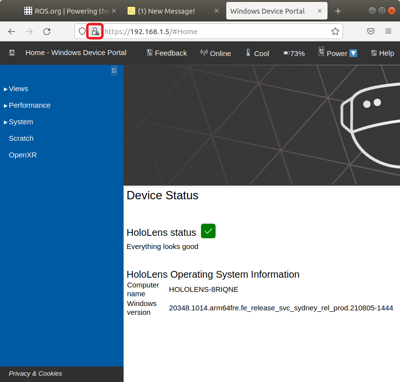

2. In the call-out, click **"Connection Not Secure"**, then **"More Information"** to open the **Page Info** menu screen and then click the **"View Certificate"** button:

    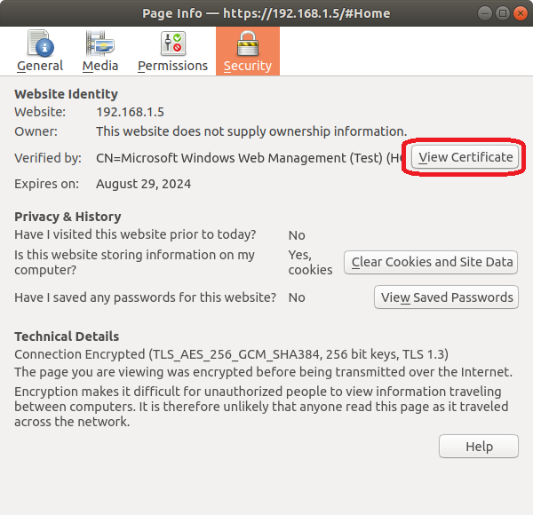

3. In the Certificate's page, click the link to download the certificate PEM file:

    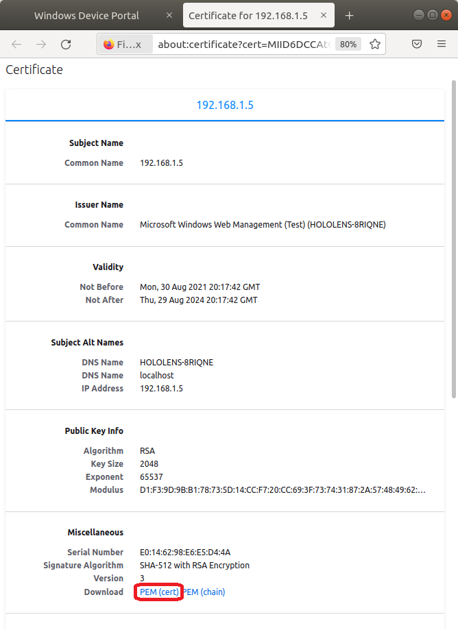

4. Convert and intall the certificates:
    ```
    $ sudo apt-get install ca-certificates -y
    $ openssl x509 -outform der -in certificate.pem -out certificate.crt
    $ sudo cp certificate.crt /usr/local/share/ca-certificates
    $ sudo update-ca-certificates
    ```

## Change or Disable HoloLens Sleep Settings (Optional)
For convenience, it may be desired to change or even turn off the HoloLens device's sleep settings to enable prolonged navigation operations. Navigate to the Device Portal by using your HoloLens IP address in a web browser and log in with the username/password set above. 
- Navigate to **Sleep Settings** in the  **System->Preferences** 
- To disable, right-click on the drop-down selector box for the sleep time-out value and select **"Inspect"**.
  - add **"0"** as a list option, which will translate to **never**
  - select the new list option **"0"** 

***Note:***  This will need to be performed twice to disable sleep for both **"battery"** and **"plugged-in"** settings.
