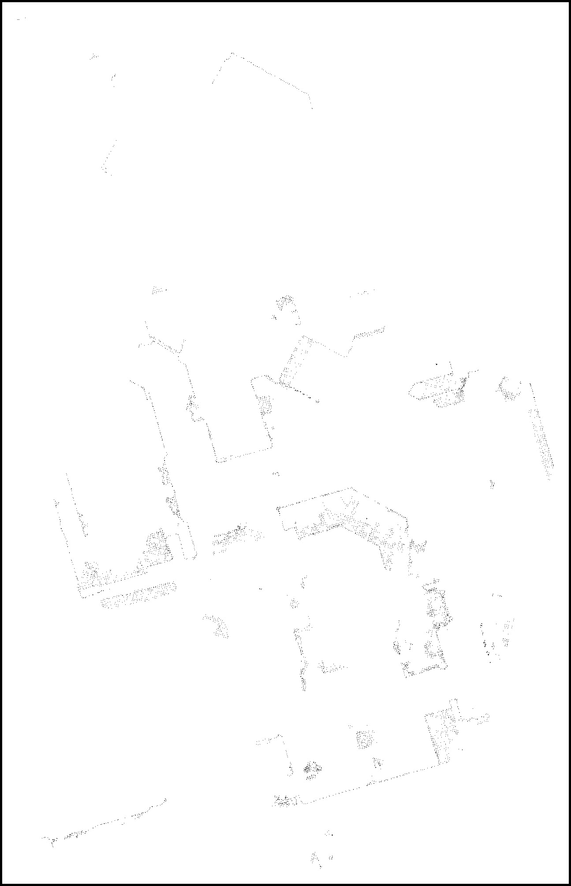

##  [Microsoft Applied Robotics Research Library](https://microsoft.github.io/AppliedRoboticsResearchLibrary/)
### Open Source Samples for Service Robotics
[](https://opensource.org/licenses/MIT) 

# Map Generation Instructions

## HoloLens Spatial Mapping

The following step-by-step procedure provides a guide for capturing a 3D spatial map of the navigation space and processing it into a 2D navigation map compatible with the ROS navigation solution. ***The procedure assumes that all of the previous sections' setup and configuration instructions have been completed and a 2D floor map has already been generated and installed in the system***.

Use the HoloLens device to perform a spatial mapping of the navigation environment. Map the floor up to at least your eye level and make sure to carefully trace along the floor edges to collect accurate readings.

For visual feedback of the map as it builds, compile and run the HoloLensNavigation application and complete the spatial mesh mapping. 

Alternatively, compile and run the lighter weight Microsoft's Holographic spatial mapping sample at this 
[link](https://github.com/microsoft/Windows-universal-samples/tree/master/Samples/HolographicSpatialMapping).

## Create a floor plan image from HoloLens' Spatial Map in ROS

- launch the HoloLensNavigation app on your HoloLens device
    - there are different ways to launch the application. Easiest way is to use the Device Portal to launch 
application. Alternatively wear the headset and launch from GUI, or launch from VisualStudio.
- launch the ROS map_server
    ```
    $ rosrun map_server map_server src/navigation_launcher/params/map.yaml
    ```
- launch the HoloLens bridge in ROS
    ```
    $ rosrun hololens_ros_bridge hololens_ros_bridge_node <hololens ip> 1234
    ```
    - note that **1234** is the port number.
- launch the HoloLens localizer in ROS
    ```
    $ rosrun hololens_localizer anchor_localizer
    ```
- launch the image saver node in ROS
    ```
    $ rosrun image_view image_saver image:=/hololens/image
    ```
- launch rviz in ROS  
    ```
    $ rviz
    ```
    - select "2D Pose Estimate" and then click anywhere on the map view to set initial position in any location and 
  direction. This instructs image_saver to create a cross-section of the HoloLens' spatial map and save it as  ***left000.jpg*** in the same folder the **image_saver** node was launched from.
- open the output graphic file and edit for navigation
    - open the file ***left0000.jpg***` with your favorite image editor. It will appear as a pattern of dots filtered by the 2D cross section of the 3D point cloud
    
    
    - using the depicted pointcloud outline, create a ROS compliant image map.
    
    - save the modified ***left0000.jpg*** file in the folder: **~/catkin_ws/src/navigation_launcher/params/**
