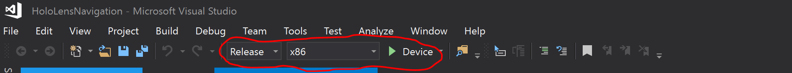

# Prerequisites, installation and build instructions

## Prerequisites

### Ubuntu 18.04.5 LTS

Install v18 LTS from https://releases.ubuntu.com/18.04/.

Install XTerm

### ROS Melodic

http://wiki.ros.org/melodic/Installation/Ubuntu.

Additional ROS packages required:

```
$ sudo apt-get install ros-melodic-driver-base
$ sudo apt-get install ros-melodic-move-base-msgs ros-melodic-octomap ros-melodic-octomap-msgs
$ sudo apt-get install ros-melodic-map-server
$ sudo apt-get install ros-melodic-camera-info-manager ros-melodic-camera-info-manager-py
$ sudo apt-get install ros-melodic-rgbd-launch
$ sudo apt-get install ros-melodic-husky-navigation
```

```
$ sudo apt-get install python-catkin-tools
```

Optional:

```
$ cd ~/catkin_ws/src/
$ git clone https://github.com/ros-teleop/teleop_twist_keyboard
$ cd ~/catkin_ws/
$ catkin_make
```

### Ceres Solver

Install dependecies:

```
sudo apt-get install libgoogle-glog-dev
sudo apt-get install libatlas-base-dev
sudo apt-get install libeigen3-dev
```

Get Ceres Solver source code, build and install it:

```
$ mkdir -p ~/ceres
$ cd ~/ceres/
wget http://ceres-solver.org/ceres-solver-1.14.0.tar.gz
tar xvf ceres-solver-1.14.0.tar.gz
mkdir ceres-build && cd ceres-build
cmake ../ceres-solver-1.14.0
make -j3
sudo make install
```

### Pepper

http://wiki.ros.org/pepper

```
$ sudo apt-get install ros-melodic-pepper-.*
$ sudo apt install ros-melodic-naoqi-bridge-msgs ros-melodic-naoqi-libqi ros-melodic-naoqi-driver ros-melodic-naoqi-libqicore
```

Download python SDK from https://developer.softbankrobotics.com/pepper-naoqi-25-downloads-linux. 

Extract `pynaoqi-python2.7-2.5.7.1-linux64.tar.gz` to `~/nao`

Add naoqi python pythonSDK path to .bashrc:
```
$ echo "export PYTHONPATH=${PYTHONPATH}:~/nao/pynaoqi-python2.7-2.5.7.1-linux64/lib/python2.7/site-packages" >> ~/.bashrc
```

Source packages:

```
$ cd ~/catkin_ws/src/
$ git clone https://github.com/ros-naoqi/naoqi_dcm_driver
$ git clone https://github.com/ros-naoqi/naoqi_bridge
$ git clone https://github.com/ros-naoqi/pepper_robot
$ cd ~/catkin_ws/
$ catkin_make
```

Disable audio in boot configuration file (set flag in line 85 from true to false):

```
$ sudo gedit /opt/ros/melodic/share/naoqi_driver/share/boot_config.json
```

Optional:

Install Choregraph.

If Choregraph fails to start, try:
```
sudo ln -sf /usr/lib/x86_64-linux-gnu/libz.so /opt/'Softbank Robotics'/'Choregraphe Suite 2.5'/lib/libz.so.1
```

## Hololens Navigation Installation

Copy `HoloROSBridge` to `~/catkin_ws/src/HoloROSBridge`

Copy `HoloLens_Localization` to `~/catkin_ws/src/HoloLens_Localization`

Copy `navigation_launcher` to `~/catkin_ws/src/navigation_launcher`

```
$ cd ~/catkin_ws/src/HoloLens_Localization/scripts
$ chown $USER:$USER dynamic_adjuster.py
$ chmod +x dynamic_adjuster.py
$ chown $USER:$USER localizer.py
$ chmod +x localizer.py
```

## Build

```
$ cd ~/catkin_ws/
$ catkin_make
```

## HoloLens Spatial Mapping application (Windows)

Enable development mode on HoloLens. Pair device with PC. Enable Device Portal.

Install Visual Studio 2019 with Universal Windows Platform build environment.  

After loading the solution in Visual Studio for the first time, navigate to 
```Tools```->```NuGet Package Manager```->```Package Manager Console```. If 
you see a message "Some NuGet packages are missing from this solution...", 
click on ```Restore``` to download and install the missing ```Eigen``` package.
At the time of development, v3.3.3 of Eigen was used for this solution.

For HoloLens generation 1: build with "Solution Configure:Release", "Solution Platform: x86"  
For HoloLens generation 2: build with "Solution Configure:Release", "Solution Platform: ARM64" 


If HoloLens device is connected via USB:



Deploy target: "Device"

If HoloLens is connected via WiFi, deploy target using Remote Machine settings.

Deploy information: https://docs.microsoft.com/en-us/windows/mixed-reality/develop/platform-capabilities-and-apis/using-visual-studio

After launching the application, you can air-tap to toggle between wirefreame and solid model render mode.


