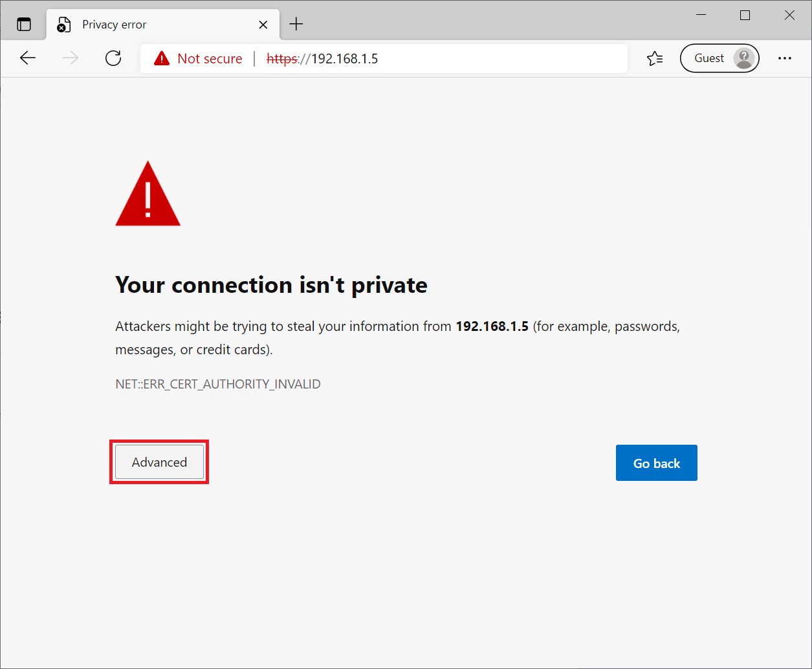
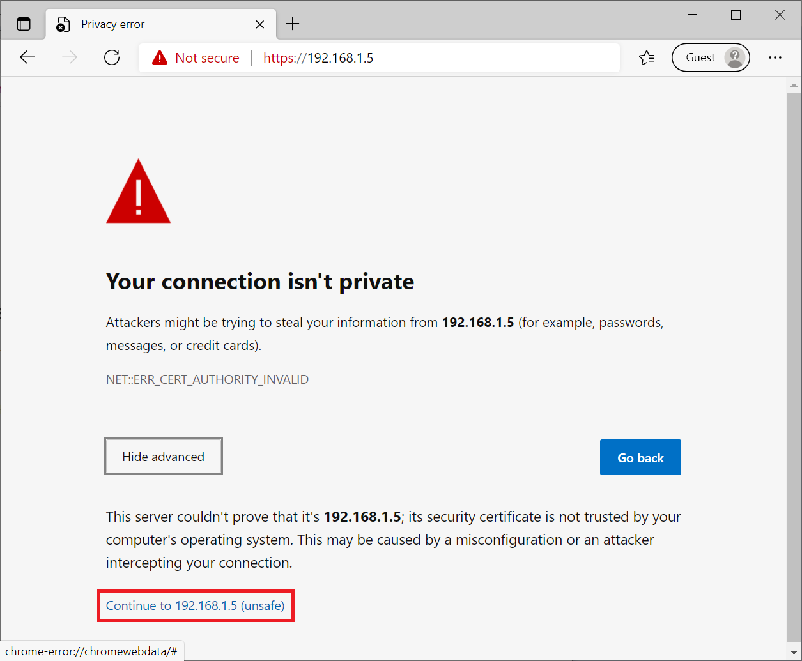
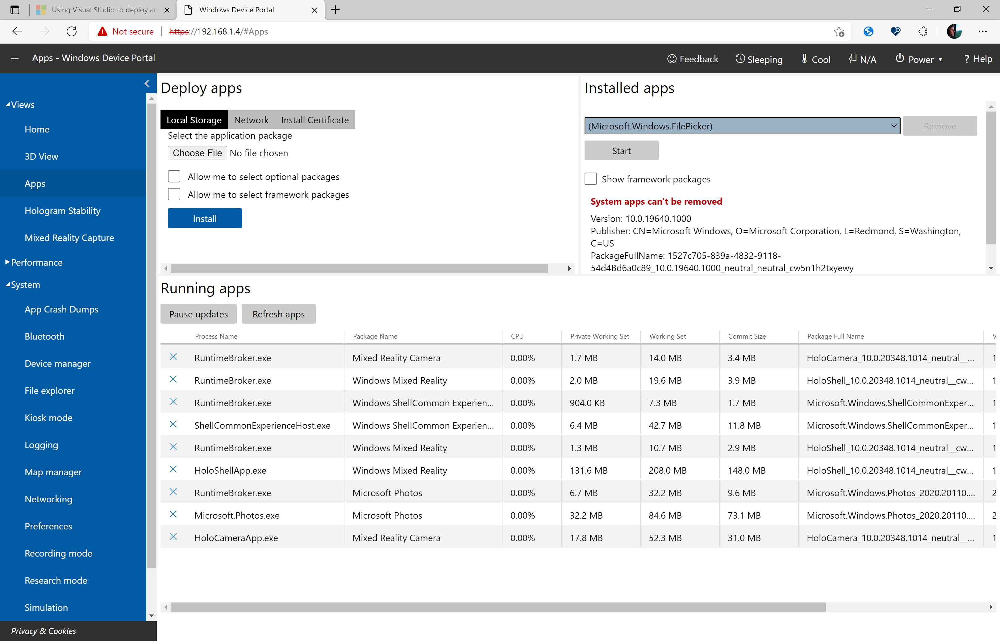
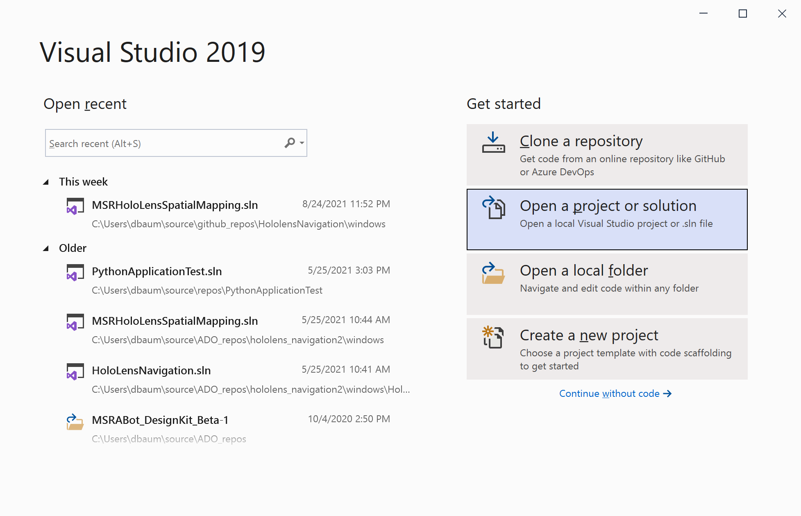
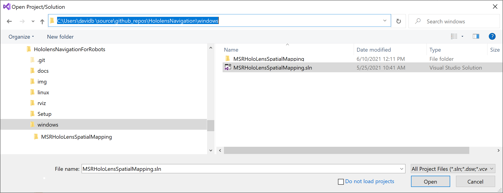
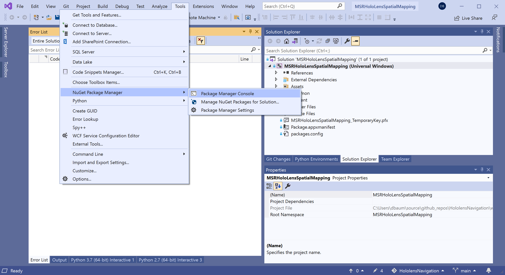
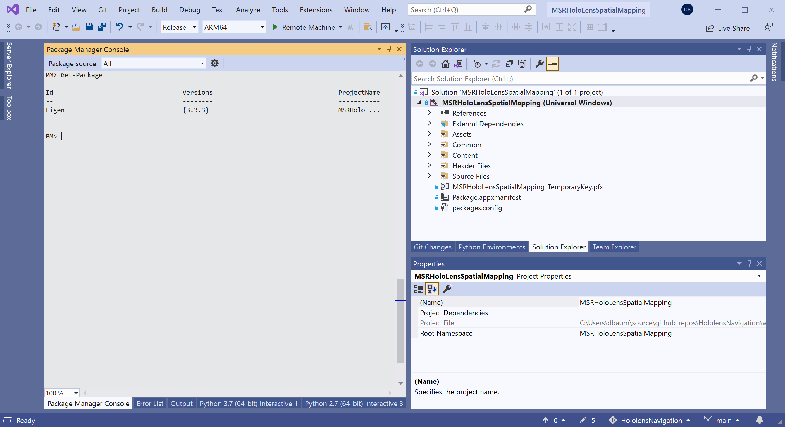
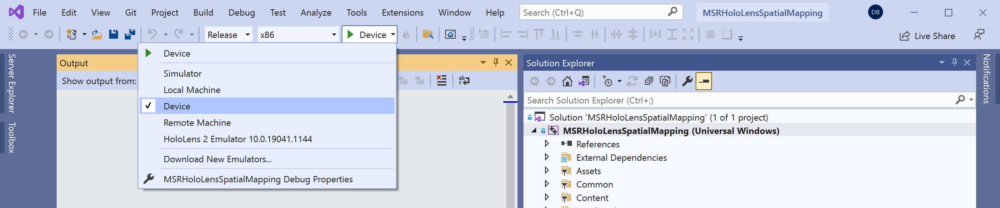
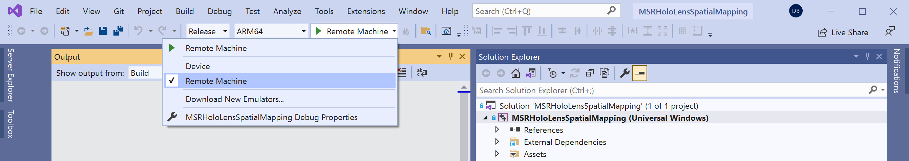

##  [Microsoft Applied Robotics Research Library](https://special-giggle-b26bab5f.pages.github.io/)
### Open Source Samples for Service Robotics
[](https://opensource.org/licenses/MIT) 

# Setup and Build Instructions
This page provides software installation, build, and configuration instructions for the HoloLensNavigationForRobots hardware components including the Navigation PC, the Build PC, the Pepper Robot, and the HoloLens device.
# Navigation PC

This section is a guide for the software required to be installed, built and configured on the Navigation PC.

## OS and Pre-requisites

To match the platform we test with, prepare an x64 Navigation PC meeting the minimum hardware requirements of the **Ubuntu 18.04.5 LTS** operating system as instructed at:

**https://releases.ubuntu.com/18.04/**

We recommend using the "standard download" desktop image for 64-bit PC (AMD64) computers (**ubuntu-18.04.5-desktop-amd64.iso**). This distribution includes a working configuration of Python 2.7 for ROS Melodic and a useful selection of network tools and desktop applications.

Install XTerm to host the terminal console-controlled calibration application:
```
$ sudo apt install xterm
```
Install dos2unix. This may be required in some cases to remove DOS carriage return characters from script text files:
```
$ sudo apt install dos2unix
```
Install required Python modules:
```
$ sudo apt install python-pip
$ pip install flask
$ pip install gevent_websocket
```

## ROS Melodic

Follow ***all*** of the installation instructions on the following web page for ROS Melodic on Ubuntu 18.04:

**http://wiki.ros.org/melodic/Installation/Ubuntu**

After a successful initial installation, these additional ROS packages are required:

```
$ sudo apt-get install ros-melodic-driver-base
$ sudo apt-get install ros-melodic-move-base-msgs ros-melodic-octomap ros-melodic-octomap-msgs
$ sudo apt-get install ros-melodic-map-server
$ sudo apt-get install ros-melodic-camera-info-manager ros-melodic-camera-info-manager-py
$ sudo apt-get install ros-melodic-rgbd-launch
$ sudo apt-get install ros-melodic-husky-navigation
$ sudo apt-get install python-catkin-tools
```

Optional tool for manually driving the robot:

```
$ cd ~/catkin_ws/src/
$ git clone https://github.com/ros-teleop/teleop_twist_keyboard
```
Verify the ROS installation builds with no errors:
```
$ cd ~/catkin_ws/
$ catkin_make
```

## Ceres Solver
The Ceres Solver provides Python libraries required for computing pathways through the navigation space.

**http://ceres-solver.org**

First, install library dependecies:

```
$ sudo apt-get install libgoogle-glog-dev
$ sudo apt-get install libatlas-base-dev
$ sudo apt-get install libeigen3-dev
```

Then, get the Ceres Solver source code, build and install it:

```
$ mkdir -p ~/ceres
$ cd ~/ceres/
$ wget http://ceres-solver.org/ceres-solver-1.14.0.tar.gz
$ tar xvf ceres-solver-1.14.0.tar.gz
$ mkdir ceres-build && cd ceres-build
$ cmake ../ceres-solver-1.14.0
$ make -j3
$ sudo make install
```

## Pepper Naoqi SDK
For reference, general ROS support for the Pepper robot and the Naoqi driver is documented here:

**http://wiki.ros.org/pepper**

First, install the following ROS packages for Naoqi:
```
$ sudo apt-get install ros-melodic-pepper-.*
$ sudo apt install ros-melodic-naoqi-bridge-msgs ros-melodic-naoqi-libqi ros-melodic-naoqi-driver ros-melodic-naoqi-libqicore
```

Then, download and install the Pepper Naoqi Python SDK:

**https://developer.softbankrobotics.com/pepper-naoqi-25-downloads-linux**

Using the desktop GUI File Manager (or your favorite Linux tool), create a new folder **~/nao** as a destination and extract the file **pynaoqi-python2.7-2.5.7.1-linux64.tar.gz**

Add the Naoqi pythonSDK path to the PYTHONPATH in the .bashrc default shell configuration file:
```
$ echo "export PYTHONPATH=${PYTHONPATH}:~/nao/pynaoqi-python2.7-2.5.7.1-linux64/lib/python2.7/site-packages" >> ~/.bashrc
```

Clone the source code packages:

```
$ cd ~/catkin_ws/src/
$ git clone https://github.com/ros-naoqi/naoqi_dcm_driver
$ git clone https://github.com/ros-naoqi/naoqi_bridge
$ git clone https://github.com/ros-naoqi/pepper_robot
$ cd ~/catkin_ws/
$ catkin_make
```

Disable audio in boot configuration file (set flag in line 85 from true to false) using the **gedit** text-editor application:

```
$ sudo gedit /opt/ros/melodic/share/naoqi_driver/share/boot_config.json
```

## Install Hololens Navigation Project Sample Software

Using the desktop GUI File Manager (or your favorite Linux tool), download and copy the project sample software for Linux (/linux folder in the repository tree) into the ROS catkin build system:

Copy **HoloLensNavigationForRobots/linux/hololens_ros_bridge** to **~/catkin_ws/src/hololens_ros_bridge**

Copy **HoloLensNavigationForRobots/linux/hololens_localization** to **~/catkin_ws/src/hololens_localization**

Copy **HoloLensNavigationForRobots/linux/navigation_launcher** to **~/catkin_ws/src/navigation_launcher**

If needed, the following commands can be used as an example:
```
$ cd ~
$ mkdir repos
$ cd repos
$ git clone https://github.com/microsoft/HoloLensNavigationForRobots
$ cp -r ~/repos/HoloLensNavigationForRobots/linux/hololens_ros_bridge/ ~/catkin_ws/src/hololens_ros_bridge/
$ cp -r ~/repos/HoloLensNavigationForRobots/linux/hololens_localization/ ~/catkin_ws/src/hololens_localization/
$ cp -r ~/repos/HoloLensNavigationForRobots/linux/navigation_launcher/ ~/catkin_ws/src/navigation_launcher/
```

Update ownership and executable-file permissions to allow the Python scripts to run:
```
$ cd ~/catkin_ws/src/holoLens_localization/scripts
$ chown $USER:$USER dynamic_adjuster.py
$ chmod +x dynamic_adjuster.py
$ chown $USER:$USER localizer.py
$ chmod +x localizer.py
```

Make with catkin to build the packages:
```
$ cd ~/catkin_ws/
$ catkin_make
```
Source the workspace:
```
$ . ~/catkin_ws/devel/setup.bash
```
For convenience, all new bash terminals can be set up with this workspace path sourced by default with the following commands:
```
$ echo "source /catkin_ws/devel/setup.bash" >> ~/.bashrc
$ source ~/.bashrc
```

# HoloLens Device
This section is a guide for configuring the HoloLens device to run the project sample software. It assumes that the user is already trained and familiar with basic HoloLens UI operations. If the HoloLens device has been set up to require a user-account to log in, this must be done each time before using the project sample software and prior to mounting the Hololens device on the Pepper robot.  If the configured user session logs out (ie. for a power-saving time-out), it is required to log back in before continuing to use this software.

## HoloLens Development Configuration
The following configuration settings support development on the HoloLens device.  
 - **Settings/Update/For developers/Developer Mode**, enabling this setting allows the HoloLens device to run non-store and non-signed applications.
 - **Settings/Update/For developers/Pair**, this control sets up a secure pairing with the Build PC to support Microsoft Visual Studio deployments of the compiled sample software on the HoloLens device.
 - **Settings/Update/For developers/Device Portal**, enabling this setting launches a web-server on the HoloLens device providing remote browser-based access to platform tools and application-management controls.

**Full instructions** are detailed on this webpage:

**https://docs.microsoft.com/en-us/windows/mixed-reality/develop/platform-capabilities-and-apis/using-the-windows-device-portal**

## HoloLens Device Portal
- On the Build PC running Windows, use a browser to navigate to the HoloLens Device Portal by using the IP address of the HoloLens device. Browser security errors will appear. Later, you can install certificates from the device as instructed below, but for this first session click the **Advanced** button to proceed:
 
- Click the **"Continue to [IP address] (unsafe)"** link:


-   The first time the portal is accessed, you will be required to set up a username and password as instructed.  The **Views/Apps** page should will look something like this:
 


## Build PC
This section is a guide for the software required to be installed, built and configured on the Build PC.

### OS and Pre-requisites

To match the platform we test with, prepare an x64 Build PC meeting the minimum hardware requirements of the **Microsoft Windows 10** operating system.

### Visual Studio 2019
**Microsoft Visual Studio 2019** is required to build and deploy the sample HoloLensSpatialMapping application used on the HoloLens device. Download and install the free community version (at minimum) following the instructions on the following website and selecting options to support the **Universal Windows Platform build environment**:

**https://visualstudio.microsoft.com/downloads/**

### HoloLens Spatial Mapping application (Windows)
The Visual Studio solution file has all the project dependencies configured to make the system ready to build and deploy the application ***MSRHoloLensSpatialMapping*** onto the HoloLens device. Clone this repository with your favorite git tools or download and extract the the files into a convenient folder on the Build PC.



From the ***windows*** subfolder in the repository, open the file: ***MSRHoloLensSpatialMapping.sln***



After the first-time load of the project solution, check that the required linear algebra package Eigen was successfully installed: 

Navigate to ***Tools -> NuGet Package Manager -> Package Manager Console***



It should appear something like the following:



However, if you see the following message in the console:
```
Some NuGet packages are missing from this solution...
``` 

Fix it by clicking on the **Restore** button that appears in the UI to download and install the missing **Eigen v3.3.3** package.


Build and deploy the application to the HoloLens device by clicking the green triangle  build button or selecting ***Build -> Build Solution*** from the menu.

**For HoloLens 1:**

Build a "Release" solution configuration for "x86" platform.  
- If the device is connected via USB, choose "Device"
- If the HoloLens is connected via Wifi, choose "Remote Machine"


**For HoloLens 2:**

Build a "Release" solution configuration for "ARM64" platform.  
- If the device is connected via USB, choose "Device"
- If the HoloLens is connected via Wifi, choose "Remote Machine"


**Full deployment instructions** are detailed on this webpage:

**https://docs.microsoft.com/en-us/windows/mixed-reality/develop/platform-capabilities-and-apis/using-visual-studio**

After launching the application in the visor, a visible mesh of the immediate environment will begin to fill in as the device is moved through the area.  
- **air-tap** to toggle between **wirefreame** and **solid model** render mode


